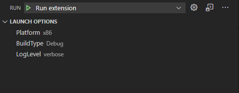

# LaunchOption README

This extension provides configurable options you can use in your launch configs.

The basic idea is that in many development scenarios, we want to run the app we are working on in numerous ways. We have a number of command line parameters and a number of build types. If we want to be able to launch each of them, we have to add a launch config for each combination :( This is the problem this extension tries to solve.

This extension adds a panel named "LAUNCH OPTIONS" to the "Run" view, from which you can switch the different options configured settings.json. The selected value can then be used from your launch configs.

## Example

The launch options can be configured this way in settings.json:

```
"launchOption.options": {
    "Platform": ["x86", "x64"],
    "BuildType": [{"name": "Debug", "value": "dbg"}, "dev", {"name": "Release", "value": "rel"}],
    "LogLevel": ["verbose", "warning", "error"],
},
```

Option value could be not only a string but an object or an array.

Each option can have a filter and the option will be visible only if the filter matched to all other options.

Here debug build type is available only for platform x86:

```
"launchOption.options": {
    "Platform": ["x86", "x64"],
    "BuildType": [
        {
            "name": "Debug",
            "value": "dbg",
            "filter": [
                {"name":"Platform", "values": ["x86"]}
            ]
        },
        "dev",
        {"name": "Release", "value": "rel"}
    ],
    "LogLevel": ["verbose", "warning", "error"],
},
```

These settings are now selectable on the "Run view":



The selected options are automatically saved in settings.json like:
```
"launchOption.currentConfig": {
    "Platform": "x64",
    "BuildType": "dev",
    "LogLevel": "verbose"
},
```

And therefore can be used in a launch config like:
```
{
    "name": "Run build",
    "type": "cppvsdbg",
    "request": "launch",
    "program": "${workspaceFolder}/build/${config:launchOption.currentConfig.Platform}/${config:launchOption.currentConfig.BuildType}/myapp.exe",
    "args": [
        "-loglevel:${config:launchOption.currentConfig.LogLevel}"
    ],
},
```

### Multi-root workspaces

When working on workspaces that have multiple workspace folders it can be convenient to store the selected options not in a `*.code-workspace` file, but in some another place. For example, if `*.code-workspace` file is committed to the VCS and now it's always marked as changed. It can be stored in two other places:

1) In `.vscode/settings.json` of one of the workspace's roots. To do this add an option "launchOption.store.folder" like this:
```
// assuming there is a folder "someFolder" in your project
"launchOption.store.folder": "someFolder"

// this way the selected options will be stored not in a `*.code-workspace`, but in `{someFolder.path}/.vscode/settings.json`
```

2) In the global user settings. To do this add an option "launchOptions.store.global" like this:
```
// project.code-workspace
"launchOption.store.global": "someProject"

// user settings will look like this:
{
    // other options here
    "launchOption.globalConfig": {
        "someProject": {
            "Platform": "x64",
            "BuildType": "dev",
            "LogLevel": "verbose"
        },

        // options of other projects here
    },
}

// using this method the launch config should also use global config
{
    // ...
    "program": "${workspaceFolder}/build/${config:launchOption.globalConfig.someProject.Platform}/${config:launchOption.globalConfig.someProject.BuildType}/myapp.exe",
    // ...
},
```

-----------------------------------------------------------------------------------------------------------


**Enjoy!**
