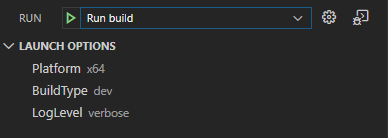

# LaunchOption README

This extension provides configurable options you can use in your launch configs.

The basic idea is that in many development scenarios, we want to run the app we are working on in numerous ways. We have a number of command line parameters and a number of build types. If we want to be able to launch each of them, we have to add a launch config for each combination :( This is the problem this extension tries to solve.

This extension adds a panel named "LAUNCH OPTIONS" to the "Run" view, from which you can switch the different options configured settings.json. The selected value can then be used from your launch configs.

## Example

The launch options can be configured this way in settings.json:

```
"launchOption.options": {
    "Platform": ["x86", "x64"],
    "BuildType": ["dbg", "dev", "rel"],
    "LogLevel": ["verbose", "warning", "error"],
},
```

These settings are now selectable on the "Run view":


The selected options are automatically saved in settings.json like:
```
"launchOption.currentConfig": {
    "Platform": "x64",
    "BuildType": "dev",
    "LogLevel": "verbose"
},
```

And therefore can be used in a launch config like:
```
{
    "name": "Run build",
    "type": "cppvsdbg",
    "request": "launch",
    "program": "${workspaceFolder}/build/${config:launchOption.currentConfig.Platform}/${config:launchOption.currentConfig.BuildType}/myapp.exe",
    "args": [
        "-loglevel:${config:launchOption.currentConfig.LogLevel}"
    ],
},
```

-----------------------------------------------------------------------------------------------------------


**Enjoy!**
